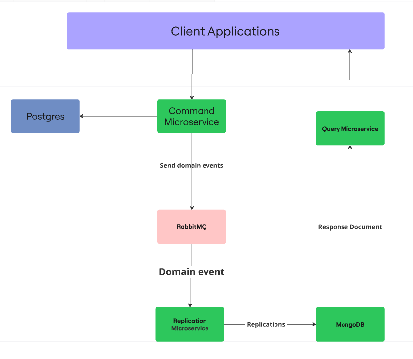

# Beautique - Microsserviço de Agendamentos (Projeto de Estudo)

[](https://www.oracle.com/java/)
[](https://spring.io/projects/spring-boot)
[](https://www.postgresql.org/)
[](https://www.rabbitmq.com/)
[](https://www.mongodb.com/)
[](https://www.docker.com/)

> ⚠️ **Projeto de Estudo**: Esta implementação foi desenvolvida para fins educacionais e de aprendizado prático de conceitos de arquitetura de microsserviços.

## 📖 Visão Geral

Projeto hands-on de um microsserviço de agendamentos para o domínio de beleza e estética, desenvolvido em **Spring Boot 3** com arquitetura orientada a eventos. A implementação explora padrões como **CQRS** e comunicação assíncrona entre serviços usando **RabbitMQ**.

## 🎯 Objetivos de Aprendizado

- Implementar arquitetura de microsserviços na prática
- Explorar o padrão CQRS com diferentes bancos de dados
- Utilizar mensageria com RabbitMQ para comunicação entre serviços
- Praticar Docker e containerização de aplicações
- Desenvolver APIs RESTful com Spring Boot

## 🏗️ Arquitetura

### Diagrama de Componentes


### Fluxo de Dados

1. **Command Side**: Recebe escritas via API REST e persiste no PostgreSQL
2. **Event Publishing**: Publica eventos de domínio no RabbitMQ
3. **Query Side**: Consume eventos e materializa visões de leitura no MongoDB

## 🛠️ Tecnologias Utilizadas

- **Java 17**: Linguagem de programação
- **Spring Boot 3**: Framework principal
    - Spring Web (REST APIs)
    - Spring Data JPA (PostgreSQL)
    - Spring AMQP (RabbitMQ)
    - Spring Security (Autenticação)
- **Bancos de Dados**:
    - PostgreSQL: Banco transacional para escritas
    - MongoDB: Banco para consultas materializadas
- **RabbitMQ**: Broker de mensagens para eventos
- **Docker & Docker Compose**: Containerização e orquestração
- **Outras Bibliotecas**:
    - MapStruct: Mapeamento entre DTOs e entidades
    - Lombok: Redução de boilerplate code
    - Flyway: Migrations do banco PostgreSQL

## 📦 Estrutura do Projeto

```
src/
├── main/
│   ├── java/br/com/beautique/
│   │   ├── config/          # Configurações (Rabbit, Security)
│   │   ├── controller/      # APIs REST
│   │   ├── service/         # Lógica de negócio
│   │   ├── repository/      # Camada de persistência
│   │   ├── messaging/       # Publicadores de eventos
│   │   ├── dto/            # Data Transfer Objects
│   │   └── entity/         # Entidades JPA
│   └── resources/
│       ├── application.properties
│       └── db/migration/   # Scripts Flyway
.devcontainer/
└── docker-compose.yml      # Infraestrutura local
```

## 🚀 Como Executar

### Pré-requisitos
- Java 17
- Maven
- Docker e Docker Compose

### 1. Clonar o repositório
```bash
git clone https://github.com/hubpedro/beautique.git
cd beautique
```

### 2. Subir a infraestrutura
```bash
docker compose -f .devcontainer/docker-compose.yml up -d
```

### 3. Executar a aplicação
```bash
# Compilar e executar
mvn clean package
mvn spring-boot:run

# Ou executar o jar
java -jar target/beautique-0.0.1-SNAPSHOT.jar
```

### 4. Acessar a aplicação
- API: http://localhost:8080/ms-beautique
- RabbitMQ Management: http://localhost:15672 (user: user, password: password)
- PostgreSQL: localhost:5432 (database: beautique_db)
- MongoDB: localhost:27017

### Credenciais de teste
- Usuário: `admin`
- Senha: `123456`

## 📡 Endpoints Principais

### Clientes
- `POST /customers/create` - Cria um novo cliente
- `GET /customers/{id}` - Busca cliente por ID
- `PATCH /customers/patch/{id}` - Atualização parcial

### Procedimentos
- `POST /api/v1/beautyProcedure/create` - Cria procedimento
- `GET /api/v1/beautyProcedure/read` - Lista com paginação
- `DELETE /api/v1/beautyProcedure/delete/{id}` - Remove procedimento

### Agendamentos
- `POST /appointments` - Cria agendamento
- `PUT /appointments` - Atualiza agendamento
- `DELETE /appointments/{id}` - Remove agendamento

## 🔍 Monitoramento

O projeto inclui Spring Boot Actuator para monitoramento:

- Health: `http://localhost:8080/ms-beautique/actuator/health`
- Metrics: `http://localhost:8080/ms-beautique/actuator/metrics`
- Info: `http://localhost:8080/ms-beautique/actuator/info`

## 💡 Conceitos Implementados

### Padrão CQRS
- **Command Side**: Operações de escrita com PostgreSQL
- **Query Side**: Operações de leitura com MongoDB (implementado em outro serviço)

### Mensageria com RabbitMQ
- Exchange do tipo Topic: `beautique-exchange`
- Filas para diferentes entidades: `customerQueue`, `beautyProcedureQueue`, `appointmentsQueue`
- Eventos publicados em JSON

### Containerização
- Docker Compose para orquestrar múltiplos serviços
- Configuração de redes e volumes persistentes


**Nota**: Este projeto foi desenvolvido para fins educacionais. Em um ambiente de produção, seriam necessárias implementações adicionais de segurança, monitoramento e resiliência.